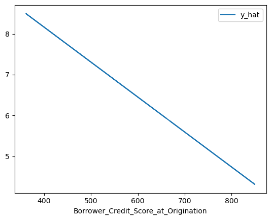
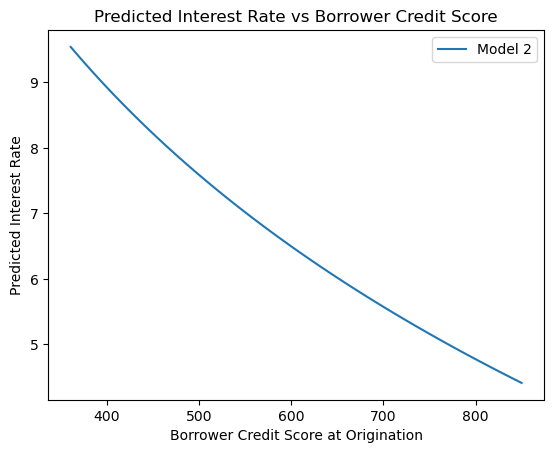
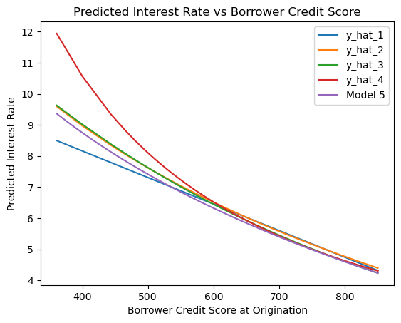

 ---
 layout: wide_default
 ---    

# THIS FILE IS IN THE HANDOUTS FOLDER. COPY IT INTO YOUR CLASS NOTES

- [**Read the chapter on the website!**](https://ledatascifi.github.io/ledatascifi-2025/content/05/02_reg.html) It contains a lot of extra information we won't cover in class extensively.
- After reading that, I recommend [this webpage as a complimentary place to get additional intuition.](https://aeturrell.github.io/coding-for-economists/econmt-regression.html)

## Today

[Finish picking teams and declare initial project interests in the project sheet](https://docs.google.com/spreadsheets/d/1SMetWKgI3JdhFdBwihDgIY3BDubvihkJCWbgLcCe4fs/edit?usp=sharing)


# Today is mostly about INTERPRETING COEFFICIENTS (6.4 in the book)

1. 25 min reading groups: Talk/read through two regression pages (6.3 and 6.4) 
    - Assemble your own notes. Perhaps in the "Module 4 notes" file, but you can do this in any file you want.
    - After class, each group will email their notes to the TA/me for participation. (Effort grading.)
1. 10 min: class builds joint "big takeaways and nuanced observations" 
1. 5 min: Interpret models 1-2 as class as practice. 
1. 20 min reading groups: Work through remaining problems below.
1. 10 min: wrap up  

---


```python
import pandas as pd
from statsmodels.formula.api import ols as sm_ols
import numpy as np
import seaborn as sns
from statsmodels.iolib.summary2 import summary_col # nicer tables
import matplotlib.pyplot as plt

```


```python
url = 'https://github.com/LeDataSciFi/ledatascifi-2025/blob/main/data/Fannie_Mae_Plus_Data.gzip?raw=true'
fannie_mae = pd.read_csv(url,compression='gzip') 
```

## Clean the data and create variables you want


```python
fannie_mae = (fannie_mae
                  # create variables
                  .assign(l_credscore = np.log(fannie_mae['Borrower_Credit_Score_at_Origination']),
                          l_LTV = np.log(fannie_mae['Original_LTV_(OLTV)']),
                          l_int = np.log(fannie_mae['Original_Interest_Rate']),
                          Origination_Date = lambda x: pd.to_datetime(x['Origination_Date']),
                          Origination_Year = lambda x: x['Origination_Date'].dt.year,
                          const = 1
                         )
                  .rename(columns={'Original_Interest_Rate':'int'}) # shorter name will help the table formatting
             )

# create a categorical credit bin var with "pd.cut()"
fannie_mae['creditbins']= pd.cut(fannie_mae['Co-borrower_credit_score_at_origination'],
                                 [0,579,669,739,799,850],
                                 labels=['Very Poor','Fair','Good','Very Good','Exceptional'])

```


```python
fannie_mae.describe()
```


<div>
<style scoped>
    .dataframe tbody tr th:only-of-type {
        vertical-align: middle;
    }

    .dataframe tbody tr th {
        vertical-align: top;
    }

    .dataframe thead th {
        text-align: right;
    }
</style>
<table border="1" class="dataframe">
  <thead>
    <tr style="text-align: right;">
      <th></th>
      <th>Loan_Identifier</th>
      <th>int</th>
      <th>Original_UPB</th>
      <th>Original_Loan_Term</th>
      <th>Original_LTV_(OLTV)</th>
      <th>Original_Combined_LTV_(CLTV)</th>
      <th>Number_of_Borrowers</th>
      <th>Original_Debt_to_Income_Ratio</th>
      <th>Borrower_Credit_Score_at_Origination</th>
      <th>Number_of_units</th>
      <th>...</th>
      <th>DEXUSEU</th>
      <th>BOPGSTB</th>
      <th>GOLDAMGBD228NLBM</th>
      <th>CSUSHPISA</th>
      <th>MSPUS</th>
      <th>l_credscore</th>
      <th>l_LTV</th>
      <th>l_int</th>
      <th>Origination_Year</th>
      <th>const</th>
    </tr>
  </thead>
  <tbody>
    <tr>
      <th>count</th>
      <td>1.350380e+05</td>
      <td>135038.000000</td>
      <td>1.350380e+05</td>
      <td>135038.000000</td>
      <td>135038.000000</td>
      <td>134007.000000</td>
      <td>135007.00000</td>
      <td>132396.000000</td>
      <td>134481.000000</td>
      <td>135038.000000</td>
      <td>...</td>
      <td>135038.000000</td>
      <td>135038.000000</td>
      <td>135038.000000</td>
      <td>135038.000000</td>
      <td>135038.000000</td>
      <td>134481.000000</td>
      <td>135038.000000</td>
      <td>135038.000000</td>
      <td>135038.000000</td>
      <td>135038.0</td>
    </tr>
    <tr>
      <th>mean</th>
      <td>5.518023e+11</td>
      <td>5.238376</td>
      <td>1.889311e+05</td>
      <td>307.064826</td>
      <td>70.057295</td>
      <td>70.860858</td>
      <td>1.58791</td>
      <td>33.298733</td>
      <td>742.428797</td>
      <td>1.035027</td>
      <td>...</td>
      <td>1.180771</td>
      <td>-42336.575453</td>
      <td>845.949803</td>
      <td>148.634283</td>
      <td>231137.664954</td>
      <td>6.607209</td>
      <td>4.207508</td>
      <td>1.624759</td>
      <td>2007.948592</td>
      <td>1.0</td>
    </tr>
    <tr>
      <th>min</th>
      <td>1.000020e+11</td>
      <td>2.250000</td>
      <td>8.000000e+03</td>
      <td>60.000000</td>
      <td>4.000000</td>
      <td>4.000000</td>
      <td>1.00000</td>
      <td>1.000000</td>
      <td>361.000000</td>
      <td>1.000000</td>
      <td>...</td>
      <td>0.852538</td>
      <td>-67823.000000</td>
      <td>256.197727</td>
      <td>93.236000</td>
      <td>157400.000000</td>
      <td>5.888878</td>
      <td>1.386294</td>
      <td>0.810930</td>
      <td>1999.000000</td>
      <td>1.0</td>
    </tr>
    <tr>
      <th>25%</th>
      <td>3.270665e+11</td>
      <td>4.250000</td>
      <td>1.080000e+05</td>
      <td>240.000000</td>
      <td>60.000000</td>
      <td>61.000000</td>
      <td>1.00000</td>
      <td>25.000000</td>
      <td>707.000000</td>
      <td>1.000000</td>
      <td>...</td>
      <td>1.072658</td>
      <td>-45943.000000</td>
      <td>350.765217</td>
      <td>130.151000</td>
      <td>190100.000000</td>
      <td>6.561031</td>
      <td>4.094345</td>
      <td>1.446919</td>
      <td>2003.000000</td>
      <td>1.0</td>
    </tr>
    <tr>
      <th>50%</th>
      <td>5.525325e+11</td>
      <td>5.250000</td>
      <td>1.640000e+05</td>
      <td>360.000000</td>
      <td>75.000000</td>
      <td>75.000000</td>
      <td>2.00000</td>
      <td>33.000000</td>
      <td>755.000000</td>
      <td>1.000000</td>
      <td>...</td>
      <td>1.191335</td>
      <td>-41360.000000</td>
      <td>857.726190</td>
      <td>145.632000</td>
      <td>224100.000000</td>
      <td>6.626718</td>
      <td>4.317488</td>
      <td>1.658228</td>
      <td>2008.000000</td>
      <td>1.0</td>
    </tr>
    <tr>
      <th>75%</th>
      <td>7.773282e+11</td>
      <td>6.125000</td>
      <td>2.470000e+05</td>
      <td>360.000000</td>
      <td>80.000000</td>
      <td>80.000000</td>
      <td>2.00000</td>
      <td>42.000000</td>
      <td>786.000000</td>
      <td>1.000000</td>
      <td>...</td>
      <td>1.316019</td>
      <td>-36519.000000</td>
      <td>1273.579545</td>
      <td>169.868000</td>
      <td>258400.000000</td>
      <td>6.666957</td>
      <td>4.382027</td>
      <td>1.812379</td>
      <td>2013.000000</td>
      <td>1.0</td>
    </tr>
    <tr>
      <th>max</th>
      <td>9.999850e+11</td>
      <td>11.000000</td>
      <td>1.170000e+06</td>
      <td>360.000000</td>
      <td>97.000000</td>
      <td>142.000000</td>
      <td>8.00000</td>
      <td>64.000000</td>
      <td>850.000000</td>
      <td>4.000000</td>
      <td>...</td>
      <td>1.575864</td>
      <td>-15946.000000</td>
      <td>1780.647727</td>
      <td>202.411000</td>
      <td>337900.000000</td>
      <td>6.745236</td>
      <td>4.574711</td>
      <td>2.397895</td>
      <td>2018.000000</td>
      <td>1.0</td>
    </tr>
    <tr>
      <th>std</th>
      <td>2.597821e+11</td>
      <td>1.289895</td>
      <td>1.087424e+05</td>
      <td>82.331674</td>
      <td>17.493178</td>
      <td>17.566607</td>
      <td>0.50841</td>
      <td>11.508698</td>
      <td>53.428076</td>
      <td>0.244345</td>
      <td>...</td>
      <td>0.172754</td>
      <td>9404.518716</td>
      <td>498.115360</td>
      <td>24.712708</td>
      <td>46186.084143</td>
      <td>0.074675</td>
      <td>0.316363</td>
      <td>0.253049</td>
      <td>5.497838</td>
      <td>0.0</td>
    </tr>
  </tbody>
</table>
<p>8 rows × 31 columns</p>
</div>


## Statsmodels

As before, the psuedocode:
```python
model = sm_ols(<formula>, data=<dataframe>)
result=model.fit()

# you use result to print summary, get predicted values (.predict) or residuals (.resid)
```

Now, let's save each regression's result with a different name, and below this, output them all in one nice table:


```python
# one var: 'y ~ x' means fit y = a + b*X

reg1 = sm_ols('int ~  Borrower_Credit_Score_at_Origination ', data=fannie_mae).fit()

reg1b= sm_ols('int ~  l_credscore  ',  data=fannie_mae).fit()

reg1c= sm_ols('l_int ~  Borrower_Credit_Score_at_Origination  ',  data=fannie_mae).fit()

reg1d= sm_ols('l_int ~  l_credscore  ',  data=fannie_mae).fit()

# multiple variables: just add them to the formula
# 'y ~ x1 + x2' means fit y = a + b*x1 + c*x2
reg2 = sm_ols('int ~  l_credscore + l_LTV ',  data=fannie_mae).fit()

# interaction terms: Just use *
# Note: always include each variable separately too! (not just x1*x2, but x1+x2+x1*x2)
reg3 = sm_ols('int ~  l_credscore + l_LTV + l_credscore*l_LTV',  data=fannie_mae).fit()
      
# categorical dummies: C() 
reg4 = sm_ols('int ~  C(creditbins)  ',  data=fannie_mae).fit()

reg5 = sm_ols('int ~  C(creditbins)  -1', data=fannie_mae).fit()

```

Ok, time to output them:


```python
# now I'll format an output table
# I'd like to include extra info in the table (not just coefficients)
info_dict={'R-squared' : lambda x: f"{x.rsquared:.2f}",
           'Adj R-squared' : lambda x: f"{x.rsquared_adj:.2f}",
           'No. observations' : lambda x: f"{int(x.nobs):d}"}

# q4b1 and q4b2 name the dummies differently in the table, so this is a silly fix
reg4.model.exog_names[1:] = reg5.model.exog_names[1:]  

# This summary col function combines a bunch of regressions into one nice table
print('='*108)
print('                  y = interest rate if not specified, log(interest rate else)')
print(summary_col(results=[reg1,reg1b,reg1c,reg1d,reg2,reg3,reg4,reg5], # list the result obj here
                  float_format='%0.2f',
                  stars = True, # stars are easy way to see if anything is statistically significant
                  model_names=['1','2',' 3 (log)','4 (log)','5','6','7','8'], # these are bad names, lol. Usually, just use the y variable name
                  info_dict=info_dict,
                  regressor_order=[ 'Intercept','Borrower_Credit_Score_at_Origination','l_credscore','l_LTV','l_credscore:l_LTV',
                                  'C(creditbins)[Very Poor]','C(creditbins)[Fair]','C(creditbins)[Good]','C(creditbins)[Vrey Good]','C(creditbins)[Exceptional]']
                  )
     )
```

    ============================================================================================================
                      y = interest rate if not specified, log(interest rate else)
    
    ============================================================================================================
                                            1        2      3 (log) 4 (log)     5         6        7        8   
    ------------------------------------------------------------------------------------------------------------
    Intercept                            11.58*** 45.37*** 2.87***  9.50***  44.13*** -16.81*** 6.65***         
                                         (0.05)   (0.29)   (0.01)   (0.06)   (0.30)   (4.11)    (0.08)          
    Borrower_Credit_Score_at_Origination -0.01***          -0.00***                                             
                                         (0.00)            (0.00)                                               
    l_credscore                                   -6.07***          -1.19*** -5.99*** 3.22***                   
                                                  (0.04)            (0.01)   (0.04)   (0.62)                    
    l_LTV                                                                    0.15***  14.61***                  
                                                                             (0.01)   (0.97)                    
    l_credscore:l_LTV                                                                 -2.18***                  
                                                                                      (0.15)                    
    C(creditbins)[Very Poor]                                                                             6.65***
                                                                                                         (0.08) 
    C(creditbins)[Fair]                                                                         -0.63*** 6.02***
                                                                                                (0.08)   (0.02) 
    C(creditbins)[Good]                                                                         -1.17*** 5.48***
                                                                                                (0.08)   (0.01) 
    C(creditbins)[Exceptional]                                                                  -2.25*** 4.40***
                                                                                                (0.08)   (0.01) 
    C(creditbins)[Very Good]                                                                    -1.65*** 5.00***
                                                                                                (0.08)   (0.01) 
    R-squared                            0.13     0.12     0.13     0.12     0.13     0.13      0.11     0.11   
    R-squared Adj.                       0.13     0.12     0.13     0.12     0.13     0.13      0.11     0.11   
    Adj R-squared                        0.13     0.12     0.13     0.12     0.13     0.13      0.11     0.11   
    No. observations                     134481   134481   134481   134481   134481   134481    67366    67366  
    R-squared                            0.13     0.12     0.13     0.12     0.13     0.13      0.11     0.11   
    ============================================================================================================
    Standard errors in parentheses.
    * p<.1, ** p<.05, ***p<.01
    

# Today. Work in groups. Refer to the lectures. 

You might need to print out a few individual regressions with more decimals.

1. Interpret coefs in model 1-4
1. Interpret coefs in model 5
1. Interpret coefs in model 6 (and visually?)
1. Interpret coefs in model 7 (and visually? + comp to table)
1. Interpret coefs in model 8 (and visually? + comp to table)
1. Add l_LTV  to Model 8 and interpret (and visually?)


```python
# reg1.summary() # to see the coef in full: -0.0086
```

## Model 1: int = 11.58 - 0.0086 credit

- beta_0: If the credit score is 0, the expected interest rate is 11.58
- If X↑  1 unit, then y↑  by βunits
- beta_1: A 1 unit increase in credit score is associated with a 0.01 p.p. decrease in the interest rate"
- If cred = 700, int = 5.56
- If cred = 707, int = 5.50
- Going from 700 to 707: rate falls 6 basis points


```python
print(11.58 - 0.0086*0)
print(11.58 - 0.0086*700)
print(11.58 - 0.0086*707)
```


    5.5600000000000005


```python
(
    fannie_mae
    .dropna(subset=['Borrower_Credit_Score_at_Origination']) # drop missing values so the next line works
    .assign(y_hat = lambda x: reg1.predict(x))
    .plot(x='Borrower_Credit_Score_at_Origination',y='y_hat',kind='line')
)

# below... I'll plot models 1-4 all at once 

```


    <Axes: xlabel='Borrower_Credit_Score_at_Origination'>


    

    


## Model 2: int = 45.37 - 6.07 log(credit)

- beta_0: If log(credit) is 0, (same as credit = 1), the expected interest rate is 45.37
- The table in 6.4 says: If X↑ 1%, then y↑  by about β/100 units
- beta_1: A 1 % increase in credit score is associated with a 0.0607 p.p. decrease in the interest rate"
- If cred = 700, int = 5.605
- If cred = 707, int = 5.545
- Going from 700 to 707: rate falls 6 basis points


```python
print(  45.37 - 6.07* np.log(1)) 
print(  45.37 - 6.07* np.log(700)) 
print(  45.37 - 6.07* np.log(707)) 
```


    5.604942366286529


## Model 3: log(int) = 2.8 - 0.0017 credit

- beta_0: If cred is 0, the expected interest rate is 17
- The table in 6.4 says: If X↑ 1 unit, then y↑ by about 100∗β %.
- beta_1: A 1 unit  increase in credit score is associated with a 0.17 % decrease in the interest rate"
- If cred = 700, int = 5.365
- If cred = 707, int = 5.30
- Going from 700 to 707: rate falls 6 basis points


```python
print(np.exp(2.87 - 0.0017*0))
print(np.exp(2.87 - 0.0017*700))
print(np.exp(2.87 - 0.0017*707))
```

    17.63701819983732
    5.365555971121975
    5.302084260759588
    


```python
# reg1c.summary() # to see the coef in full: -0.0017
```

## Model 4: log(int) = 9.5 - 1.19 log(credit)

- beta_0: If log(cred) is 0, (cred is 1) the expected interest rate is exp(9.5) === 13,359%
- The table in 6.4 says: If X↑ 1 %, then y↑ by about β %.
- beta_1: A 1 %  increase in credit score is associated with a 1.19 % decrease in the interest rate"
- If cred = 700, int = 5.49
- If cred = 707, int = 5.43
- Going from 700 to 707: rate falls 6 basis points


```python
print(np.exp(9.5 - 1.19*0))
print(np.exp(9.5 - 1.19*np.log(700)))
print(np.exp(9.5 - 1.19*np.log(707)))
```

    13359.726829661873
    5.497065482961815
    5.432359161191803
    

## Model 5: int = 44.13 - 5.99 log(Cred) - 0.15 log(LTV)

(Start Thursday here)

- Just focusing now on beta_1...
- A one percent increase in credit score is associated with a 0.0599 p.p. (5.99 b.p.) decline in int rate, **holding all logLTV constant**
- If cred = 700, int = 5.396
- If cred = 707, int = 5.33
- Going from 700 to 707: rate falls 6 basis points


```python
fannie_mae[['Original_LTV_(OLTV)']].mean()

```


    Original_LTV_(OLTV)    70.057295
    dtype: float64


```python
print(44 - 5.99*np.log(700) + .15*np.log(70))
print(44 - 5.99*np.log(707) + .15*np.log(70))

```

    5.396303079397407
    5.336700597586928
    


```python
reg2.summary()


# plot the model using params. set LTV to its avg, 70
# y = 44 - 5.99*log(X) + .15*70
# for X from credit score min to credit score max

credit_scores = np.linspace(fannie_mae['Borrower_Credit_Score_at_Origination'].min(), 
                            fannie_mae['Borrower_Credit_Score_at_Origination'].max(), 100)
reg2_predicted_interest_rates = reg2.params.iloc[0] +\
                                reg2.params.iloc[1] * np.log(credit_scores) +\
                                reg2.params.iloc[2] * np.log(70)

plt.plot(credit_scores, reg2_predicted_interest_rates, label='Model 2')
plt.xlabel('Borrower Credit Score at Origination')
plt.ylabel('Predicted Interest Rate')
plt.title('Predicted Interest Rate vs Borrower Credit Score')
plt.legend()
plt.show()


```


    

    


## Model 6

The "impact" of credit score on interest now depends on logLTV. 

(We worked on the board)


```python
print(-16 + 3.2*np.log(700) + 14.6*np.log(70) -2.2*np.log(700)*np.log(70) )
print(-16 + 3.2*np.log(707) + 14.6*np.log(70) -2.2*np.log(707)*np.log(70) )
```

    5.760573611886471
    5.699412017386301
    

## Model 7

## Model 8

## Plot models 1-4:


```python
reg1.predict(fannie_mae['Borrower_Credit_Score_at_Origination'])
```


    0         5.860809
    1         5.655570
    2         5.245091
    3         4.706338
    4         5.954878
                ...   
    135033    5.450331
    135034    5.792396
    135035    4.843164
    135036    6.271288
    135037    5.937774
    Length: 135038, dtype: float64


```python
# models 1-4 I just plot by adding y_hat_* to the dataframe

subset = fannie_mae.dropna(subset=['Borrower_Credit_Score_at_Origination','l_credscore']).copy()

subset['y_hat_1'] = reg1.predict(fannie_mae['Borrower_Credit_Score_at_Origination'])
subset['y_hat_2'] = reg1b.predict(fannie_mae['l_credscore'])
subset['y_hat_3'] = np.exp(reg1c.predict(fannie_mae['Borrower_Credit_Score_at_Origination']))
subset['y_hat_4'] = np.exp(reg1d.predict(fannie_mae['l_credscore']))
```


```python
# now plot
(
subset[['y_hat_1','y_hat_2','y_hat_3','y_hat_4','Borrower_Credit_Score_at_Origination']]
.sort_values('Borrower_Credit_Score_at_Origination')
.set_index('Borrower_Credit_Score_at_Origination')
.plot()
)

# to do plots for other models, just make an X array for the plot with values we want
# and then use the model to predict the y values via formula
# this is ad hoc, but built in SM plotting options don't work well for multiple models on one plot
# where some Xs are transformed for the plot 

credit_scores = np.linspace(fannie_mae['Borrower_Credit_Score_at_Origination'].min(), 
                            fannie_mae['Borrower_Credit_Score_at_Origination'].max(), 100)
reg2_predicted_interest_rates = reg2.params.iloc[0] +\
                                reg2.params.iloc[1] * np.log(credit_scores) +\
                                reg2.params.iloc[2] * np.log(70)

# add reg2 plot to this using reg2_credit_scores, reg2_predicted_interest_rates
plt.plot(reg2_credit_scores, reg2_predicted_interest_rates, label='Model 5')

plt.xlabel('Borrower Credit Score at Origination')
plt.ylabel('Predicted Interest Rate')
plt.title('Predicted Interest Rate vs Borrower Credit Score')
plt.legend()
plt.show()

```


    

    


Vocab:

For a given X_1 coefficient in a regression

- "null hypothesis": beta of X_1 = 0. "it is NOT related to y"
- we can reject the null
- we can NOT accept the null 
- std errors
- t-stats
- p-values
- economic significance
